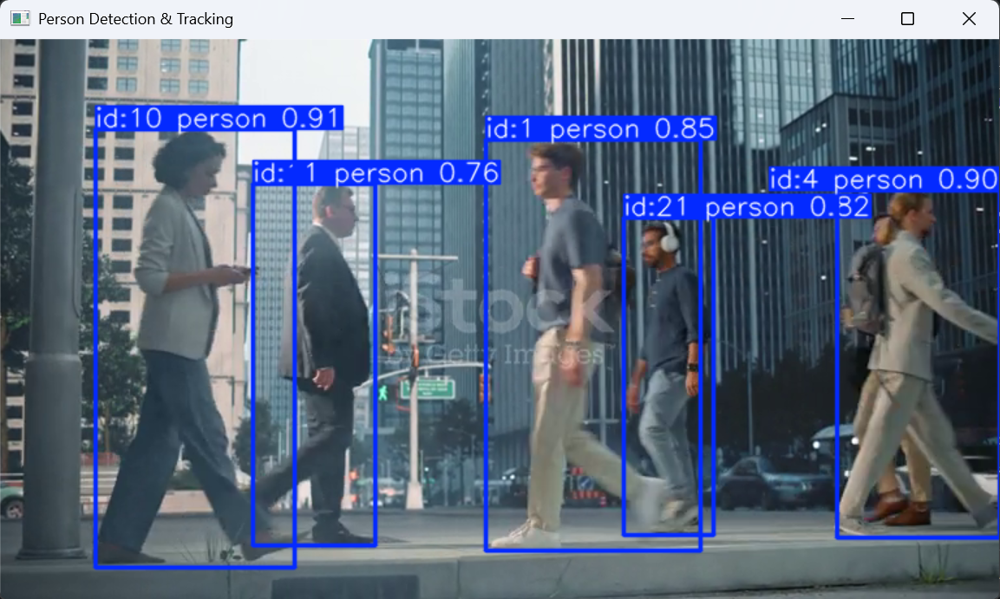
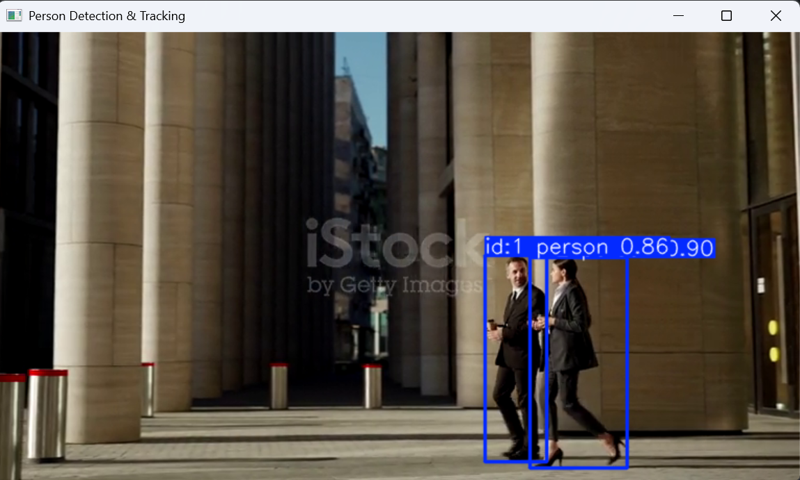

# 🎯 Object Detection and Tracking
### CodeAlpha Internship – Task 3

<p align="center">
  
  
  
  
</p>

---

## 📌 Project Overview

This project implements **real-time object detection and tracking** using **YOLOv8** (You Only Look Once, version 8) — one of the most powerful and efficient object detection models available today. The system is capable of:

- Detecting multiple object classes (people, vehicles, animals, etc.) in video streams
- Assigning unique tracking IDs to each detected object across frames
- Drawing bounding boxes and labels with confidence scores
- Processing pre-recorded `.mp4` video files and saving/displaying the annotated output

This project was completed as **Task 3** of the **CodeAlpha Machine Learning Internship**.

---

## 📂 Project Structure

```
CodeAlpha-Object Detection and Tracking/
│
├── code.ipynb              # Main Jupyter Notebook (detection + tracking pipeline)
├── yolov8n.pt              # Pre-trained YOLOv8 Nano model weights
│
├── Videos/
│   ├── 1.mp4               # Sample input video 1
│   ├── 2.mp4               # Sample input video 2
│   └── 3.mp4               # Sample input video 3
│
├── screenshots/
│   ├── code 1 task 3 dec.png   # Output screenshot 1
│   └── code out 2 dec.png      # Output screenshot 2
│
└── README.md               # Project documentation (this file)
```

---

## 🧠 What Happens in the Code (`code.ipynb`)

The notebook follows a clean and structured pipeline:

### Step 1 — Import Libraries
```python
from ultralytics import YOLO
import cv2
```
The two core libraries are imported:
- **`ultralytics`** – provides the YOLO model interface for detection and tracking
- **`cv2` (OpenCV)** – handles video reading, frame-by-frame processing, and display

---

### Step 2 — Load the YOLOv8 Model
```python
model = YOLO("yolov8n.pt")
```
The pre-trained **YOLOv8 Nano** model (`yolov8n.pt`) is loaded. This model has been trained on the **COCO dataset** which includes 80 object classes such as:
`person`, `car`, `truck`, `bus`, `bicycle`, `motorcycle`, `dog`, `cat`, and many more.

---

### Step 3 — Open the Video File
```python
cap = cv2.VideoCapture("Videos/1.mp4")
```
A video file is loaded using OpenCV's `VideoCapture`. The notebook reads the video frame by frame in a loop.

---

### Step 4 — Run Detection & Tracking on Each Frame
```python
results = model.track(frame, persist=True)
```
For every frame:
- **`model.track()`** runs YOLOv8's built-in tracking (using **ByteTrack** or **BoTSORT** algorithm)
- `persist=True` ensures that object IDs are **maintained consistently** across consecutive frames
- Each detected object gets: a **bounding box**, a **class label**, a **confidence score**, and a **unique tracker ID**

---

### Step 5 — Annotate and Display Frames
```python
annotated_frame = results[0].plot()
cv2.imshow("Object Detection & Tracking", annotated_frame)
```
The built-in `.plot()` method renders all bounding boxes, labels, and IDs directly onto the frame. The annotated frames are displayed in real time using OpenCV's window.

---

### Step 6 — Exit Condition
```python
if cv2.waitKey(1) & 0xFF == ord('q'):
    break
cap.release()
cv2.destroyAllWindows()
```
Press **`q`** on your keyboard at any time to stop the video. Resources are properly released afterward.

---

## 🖼️ Output Screenshots

Below are the actual outputs generated by the model on sample videos:

### 📸 Screenshot 1 — Multi-Object Detection with Tracking IDs


---

### 📸 Screenshot 2 — Bounding Boxes and Labels in Action


---

## 🔁 How to Change the Input Video

To test the system on a **different video**, simply change the video file path in the notebook cell where the video is loaded.

### 📍 Find this line in `code.ipynb`:
```python
cap = cv2.VideoCapture("Videos/1.mp4")
```

### ✅ Replace it with any of the following:

| Video | Code to Use |
|-------|-------------|
| Video 1 | `cv2.VideoCapture("Videos/1.mp4")` |
| Video 2 | `cv2.VideoCapture("Videos/2.mp4")` |
| Video 3 | `cv2.VideoCapture("Videos/3.mp4")` |
| Your own video | `cv2.VideoCapture("Videos/your_video.mp4")` |

> 💡 **Tip:** You can also use `cv2.VideoCapture(0)` to use your **webcam** for live real-time detection!

---

## ⚙️ Requirements

Install the required dependencies using pip:

```bash
pip install ultralytics opencv-python
```

| Library | Purpose |
|---------|---------|
| `ultralytics` | YOLOv8 model loading, inference, and tracking |
| `opencv-python` | Video I/O and frame rendering |

---

## 🚀 How to Run

1. Clone or download this repository
2. Make sure `yolov8n.pt` is in the root directory
3. Place your input video inside the `Videos/` folder
4. Open `code.ipynb` in Jupyter Notebook or VS Code
5. Run all cells from top to bottom
6. A window will appear showing the live detection and tracking output
7. Press **`q`** to quit

---

## 🧩 Technologies Used

| Tool | Description |
|------|-------------|
| **YOLOv8 (Nano)** | State-of-the-art real-time object detection model |
| **Ultralytics** | Python library for YOLOv8 with built-in tracking |
| **OpenCV** | Computer vision library for video processing |
| **COCO Dataset** | 80-class dataset the model was pre-trained on |
| **ByteTrack / BoTSORT** | Multi-object tracking algorithms used internally |
| **Jupyter Notebook** | Interactive Python environment for running the pipeline |

---

## 👤 Author

**Asim Taseer**

📎 Connect with me on LinkedIn: [linkedin.com/in/asimtaseer](https://linkedin.com/in/asimtaseer)

---

<p align="center">Made with ❤️ as part of the CodeAlpha Machine Learning Internship</p>
