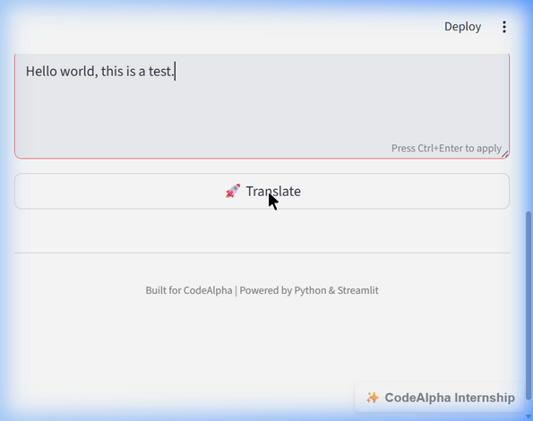

<div align="center">
  <h1>🌍 Language Translation Tool</h1>
  <p><strong>Fast, accurate, and easy-to-use translator with Text-to-Speech support</strong></p>
  
  [](#)
  [](#)
  [](#)
  [](#)
  [](#)
</div>

---

## 📖 Introduction
The **Language Translation Tool** is an interactive web application built precisely to perform seamless translations across numerous languages. Designed as part of the CodeAlpha Internship, this project acts as a bridge between users and Google's powerful translation engines, paired conveniently with an integrated Text-to-Speech playback capability.

## 🛠️ Tools & Technologies Used
| Package/Tool | Description |
| :--- | :--- |
| **[Python](https://www.python.org/)** | The core programming language powering the application's backend logic. |
| **[Streamlit](https://streamlit.io/)** | A rapid frontend framework providing the interactive graphical capabilities and layout. |
| **[googletrans](https://pypi.org/project/googletrans/)** | An independent Python library utilizing the Google Translate API for deep and fast translations. |
| **[gTTS](https://pypi.org/project/gTTS/)** | Google Text-to-Speech engine allowing translated words to natively synthesize into playable audio clips. |

## ✨ Core Features
- **Multi-language Array:** Switch between "Auto-Detect" and any widely spoken language dynamically.
- **Audio Playback:** Integrated `.mp3` rendering allowing correct pronunciation for final text.
- **Minimalist UI:** Clean interface optimized for readability with integrated copy functionality. 

---

## 🚀 Workflow & Quick Start

Follow these steps from initializing your folder to having the application seamlessly running on your local machine:

### 1. Initialize Virtual Environment
It's an industry best-practice to isolate your application's dependencies!
```bash
# Create a virtual environment named "venv"
python -m venv translator_env
```

### 2. Activate the Environment
Before interacting with your packages, activate the environment dynamically:
```bash
# Windows (PowerShell)
.\translator_env\Scripts\Activate.ps1

# Windows (Command Prompt)
.\translator_env\Scripts\activate
```

### 3. Install the Dependencies
Pull the specific tool versions (`streamlit`, `gTTS`, `googletrans`) that run the app:
```bash
pip install -r requirements.txt
```

### 4. Run the Architecture!
Launch the application securely. The dashboard will automatically launch at `http://localhost:8501`.
```bash
streamlit run app.py
```

---

## 📸 Platform Display Showcase



---

## 👨‍💻 Developer & Author
**Asim Taseer**  
💼 **LinkedIn Profile:** [linkedin.com/in/asimtaseer](https://linkedin.com/in/asimtaseer)
